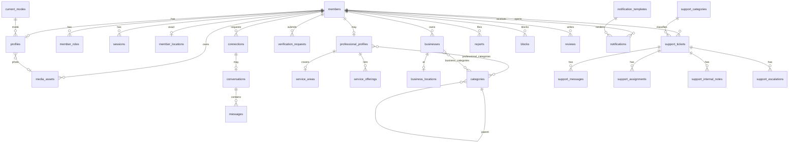

# Database ERD proposal (Phase 1)

PostgreSQL 16 + PostGIS. UUID primary keys. `created_at` / `updated_at` on mutable tables. Prisma migrations; geography columns and GiST indexes in SQL.

Exact personal coordinates and phone numbers are restricted columns. Public APIs never select them for other members.

## Entity-relationship (logical)

## Tables

### Identity and auth

**members**  
`id`, `phone_e164` (unique), `status` (`ACTIVE|SUSPENDED|DELETED`), `created_at`  
Phone is never in public serializers.

**member_roles**  
`member_id`, `role` (`MEMBER|ADMIN|SUPPORT_AGENT|MODERATOR`), unique pair.  
`MEMBER` is implicit for all rows in `members`; optional to store explicitly. Professional is **not** a role; it is `professional_profiles`.

**otp_challenges**  
`id`, `phone_e164`, `code_hash`, `purpose`, `expires_at`, `attempt_count`, `max_attempts`, `last_sent_at`, `consumed_at`, `ip`, `device_id`

**sessions**  
`id`, `member_id`, `device_id`, `refresh_token_hash`, `expires_at`, `revoked_at`, `ip`, `user_agent`, `last_seen_at`, `token_family_id`

### Profile and mode

**current_modes** (admin-seeded, not hardcoded in app logic)  
`id`, `code`, `label`, `is_active`, `sort_order`  
Seed: `AVAILABLE`, `LOOKING_FOR_WORK`, `LOOKING_FOR_BUSINESS`, `LOOKING_FOR_COLLABORATION`, `PROMOTING_SERVICE`, `CREATING`, `WORKING`, `AWAY`

**profiles**  
`member_id` PK/FK, `display_name`, `bio`, `photo_media_id`, `current_mode_id`, `status_text` (short), `is_discoverable`

### Location

**member_locations**  
`member_id` PK, `geog` `geography(Point,4326)`, `updated_at`  
**No public SELECT.**

**member_public_locations**  
`member_id`, `approx_geog` (snapped), `label` (e.g. barangay-level string), `cell_id`  
Updated when exact location changes.

**service_areas**  
`professional_profile_id`, `center_geog`, `radius_meters`, `area_geog` nullable polygon

**business_locations**  
`business_id`, `geog`, `address_text`, `is_public`

### Catalog

**categories**  
`id`, `parent_id`, `slug`, `name`, `icon_media_id`, `applies_to` (`PROFESSIONAL|BUSINESS|SERVICE|ALL`), `is_active`, `sort_order`

**professional_profiles**  
`id`, `member_id` unique, `experience_years`, `availability` (`AVAILABLE|BUSY|UNAVAILABLE` or config), `identity_verification_status`, `skill_verification_status` (always distinct; skill stays `NOT_STARTED` in Phase 1 writes)

**professional_categories**  
`professional_profile_id`, `category_id` M2M

**professional_skills**  
`id`, `professional_profile_id`, `label`, `category_id` nullable

**service_offerings**  
`id`, `professional_profile_id`, `category_id`, `title`, `description`, `display_price_amount`, `display_currency`, `cover_media_id`, `is_active`  
No booking columns.

**businesses**  
`id`, `owner_member_id`, `name`, `description`, `hours_json`, `identity_or` wait — **business_verification_status** (`NOT_STARTED|PENDING|UNDER_REVIEW|VERIFIED|REJECTED|EXPIRED`), `cover_media_id`

**business_categories**  
`business_id`, `category_id`

### Media

**media_assets**  
`id`, `owner_member_id`, `bucket`, `object_key`, `mime_type`, `byte_size`, `width`, `height`, `purpose` (`AVATAR|PORTFOLIO|CHAT|BUSINESS|VERIFICATION|THEME_LOGO`), `status` (`PENDING_UPLOAD|READY|REJECTED`), `checksum`

Bytes stay in S3. Verification media is not publicly readable.

### Social

**connections**  
`id`, `requester_id`, `addressee_id`, `status` (`PENDING|ACCEPTED|REJECTED`), unique pair (ordered or canonicalized)

**conversations**  
`id`, `connection_id` unique nullable, `type` (`DIRECT`)

**conversation_participants**  
`conversation_id`, `member_id`

**messages**  
`id`, `conversation_id`, `sender_id`, `type` (`TEXT|IMAGE`), `body`, `media_id`, `created_at`

**message_reads**  
`message_id`, `member_id`, `read_at`

### Trust

**verification_requests**  
`id`, `member_id`, `type` (`IDENTITY|BUSINESS|SKILL`), `status` (`NOT_STARTED` is absence of row or explicit), `status` values: `PENDING|UNDER_REVIEW|VERIFIED|REJECTED|EXPIRED`, `business_id` nullable, `payload_json` (document media ids), `reviewer_id`, `review_note`, `decided_at`  
Phase 1 product flow: IDENTITY only. SKILL/BUSINESS types exist so we do not migrate later; APIs for SKILL are not exposed.

**stories**  
`id`, `member_id`, `kind` (`IMAGE|VIDEO|LIVE`), media ids, `hls_url`, `preview_hls_url`, `expires_at` (~24h), `moderation_status`

**live_sessions**  
`id`, `member_id`, `status` (`LIVE|ENDED`), `hls_url`, `preview_hls_url`, `ingest_url`

**review_aggregates**  
`subject_type`, `subject_id`, `avg_rating`, `count` — maintained in service transaction

**reports**  
`id`, `reporter_id`, `target_type` (`MEMBER|MESSAGE|PROFILE|BUSINESS|SERVICE`), `target_id`, `reason_code`, `details`, `status` (`OPEN|ACTIONED|DISMISSED`)

**blocks**  
`blocker_id`, `blocked_id`, unique

**moderation_actions**  
`id`, `report_id` nullable, `actor_id`, `action` (`HIDE|WARN|SUSPEND`), `entity_type`, `entity_id`

### Notifications

**notification_templates**  
`id`, `key`, `channel` (`IN_APP`), `title_template`, `body_template`, `is_active`

**notifications**  
`id`, `member_id`, `template_key`, `payload_json`, `read_at`, `created_at`

**notification_preferences**  
`member_id`, `key`, `enabled`

**device_push_tokens**  
`member_id`, `token`, `platform` — table ready; sending optional in Phase 1

### Support

**support_categories**  
`id`, `name`, `is_active`, `sort_order` — admin configurable

**support_tickets**  
`id`, `member_id`, `category_id`, `subject`, `status` (`OPEN|PENDING|RESOLVED|CLOSED`), `priority`

**support_messages**  
`id`, `ticket_id`, `author_member_id`, `body`, `media_id`, `is_internal` false for member-visible

**support_assignments**  
`id`, `ticket_id`, `assignee_id`, `assigned_at`

**support_internal_notes**  
`id`, `ticket_id`, `author_id`, `body`

**support_escalations**  
`id`, `ticket_id`, `from_assignee_id`, `to_assignee_id`, `reason`, `created_at`

### Configuration and audit

**theme_configs**  
`id`, `version`, `status` (`DRAFT|PUBLISHED`), `tokens_json`, `logo_media_id`, `published_at`, `published_by`

**remote_configs**  
`key`, `value_json`, `environment`, `updated_at`

**feature_flags**  
`key`, `enabled`, `rules_json`, `description`

**discovery_ranking_weights**  
`id`, `distance`, `category_relevance`, `availability`, `verification`, `rating`, `activity`, `active`  
One active row.

**audit_logs**  
`id`, `actor_id`, `action`, `entity`, `entity_id`, `before_json`, `after_json`, `ip`, `request_id`, `created_at`  
Append-only. Indexes on `actor_id`, `entity+entity_id`, `created_at`, `request_id`.

## Indexes (non-exhaustive)

- `members(phone_e164)` unique
- GiST `member_locations(geog)`, `member_public_locations(approx_geog)`, `service_areas(center_geog)`, `business_locations(geog)`
- `connections(requester_id, addressee_id)` unique
- `messages(conversation_id, created_at)`
- `notifications(member_id, created_at)`
- `verification_requests(status, type)`
- `audit_logs(created_at DESC)`

## Intentionally absent (Phase 1)

`subscriptions`, `invoices`, `payment_methods`, `bookings`, `invoices_line_items`, `crm_pipelines`, `streams`, `wallets`, `token_ledger`, `team_memberships`.

`stories` and `live_sessions` are Phase 2 (flag `stories.live`). Nullable `locality_id` on location tables is allowed as a forward-compatible column without a cities admin product.
